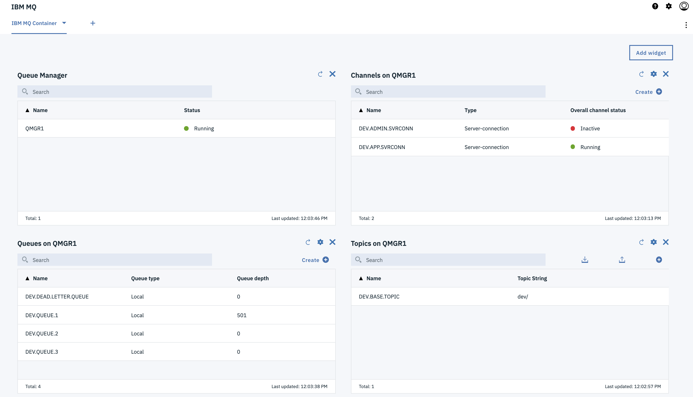
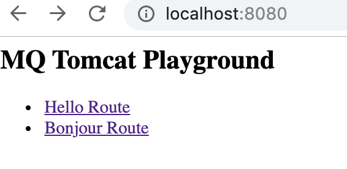
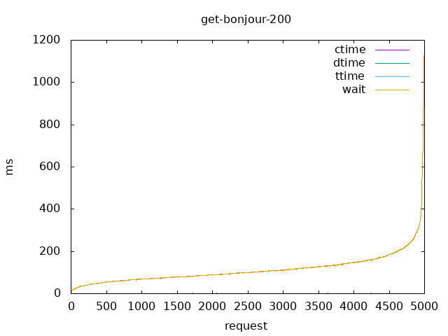
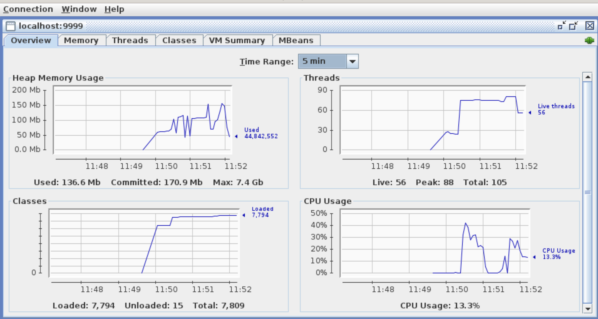
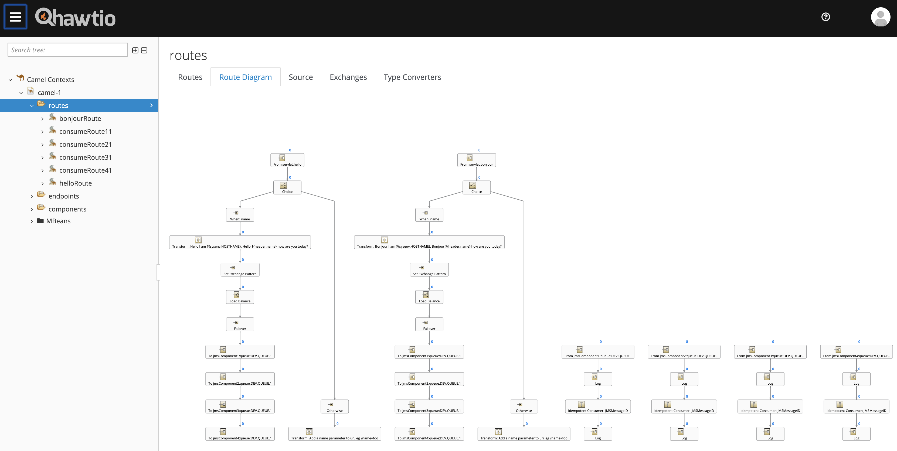
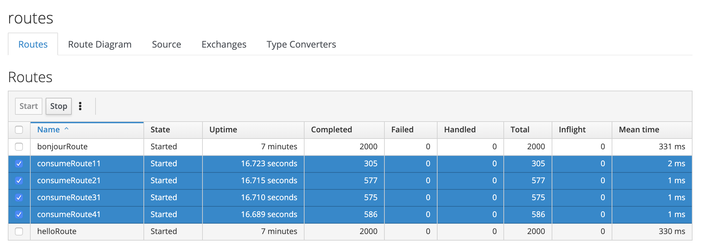

## ibmmq-tomcat-camel

### Design

- multiple independent IBM.MQ QMGR's
- multiple independent application pods (camel/tomcat)
- produce and consume messages using camel jms component
- idempotent consumer EIP 
- failover EIP to QMGR's
- simple round robin load balancing EIP over application pods and QMGR's (each pod connects to every QMGR)
- local transactions on QMGR's for single resource (survive a QMGR restart/outage)
- persistent volumes for QMGR's for durable messages
- scale out from one to many application pods
- scale from one to many QMGR's
- jms pooled caching connection factory

### Local

Run locally 

```
docker-compose up
```

Login QMGR WebConsole#1. All QMGR's (:9443, :10443, :11443, :12443)
```
https://localhost:9443/ibmmq/console/
admin / passw0rd
```



Test sending a single message to `DEV.QUEUE.1` - browse to:

```
http://localhost:8080/camel/hello?name=mike
```



Performance testing
```
# run test
cd performance 
./performance-test.sh
```

Tests results are stored here
```
# view graphs and results stored here (need gnuplot installed for graphs)
/tmp/data/performanceresults
```



Srop QMGR1 pod/container during the test run. The correct number of messages should still be delivered / processed - you can checkl the counts at the end of the test run (remember to start qmgr1 again so you can count what was delivered).
```
docker-compose stop qmgr1
```

To watch JVM metrics - connect to tomcat on `localhost:9999` in jconsole.
```
jconsole &
```



To see camel routes in hawtio
```
# start local hawtio
java -jar ~/Downloads/hawtio-app-2.8.0.jar --port 8090

# browse to hawtio
http://localhost:8090/hawtio

# connect to jolokia running in application
http://localhost:8080/jolokia
```



You can also start the Consumer Routes in Hawtio - these are set to NOT autoStart by default so we can test sending messages.



Clone this repo and build
```
cd ~/git/ibmmq-tomcat-camel
./buildrun.sh
```

### OpenShift

Create new project

```
oc new-project ibmmq-tomcat-camel
oc adm policy add-scc-to-user anyuid -z default
```

Deploy 4 queue manager pods (requires PVC).

```
export QMGRNO=4
./deploy-ibmmq.sh
```

Deploy 8 application pods
```
oc apply -f ibmmq-tomcat-camel-deploy.yaml
```

Test application performance
```
export HOST=http://$(oc get route ibmmq-tomcat-camel --template='{{ .spec.host }}')

./performance/performance-test.sh
```

Build and push application image
```
make docker-push
```

Deploy new version to OpenShift
```
oc import-image --confirm quay.io/eformat/ibmmq-tomcat-camel:latest
```

#### Links

- https://camel.apache.org/manual/latest/loadBalance-eip.html
- https://blog.joshdreagan.com/2017/08/14/transactions_and_alternatives_with_camel/
- http://tmielke.blogspot.com/2012/03/camel-jms-with-transactions-lessons.html?m=1
- https://camel.apache.org/manual/latest/idempotentConsumer-eip.html
- https://oss.sonatype.org/service/local/repositories/releases/content/io/hawt/hawtio-app/2.8.0/hawtio-app-2.8.0.jar
