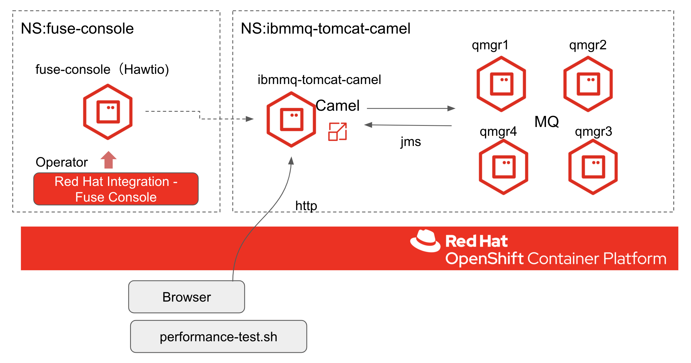
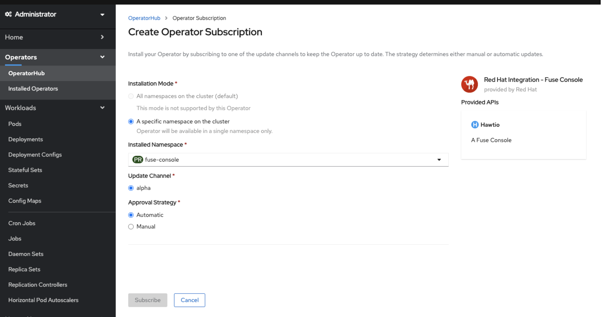
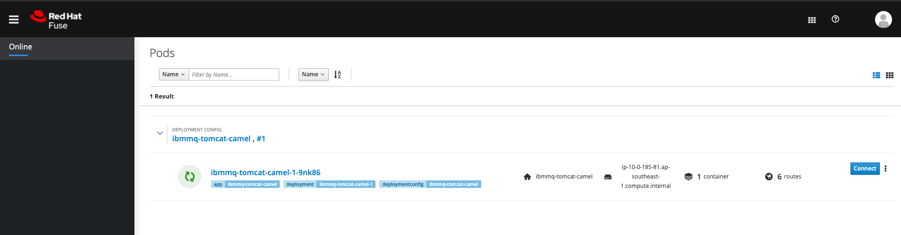
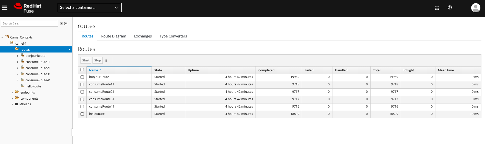
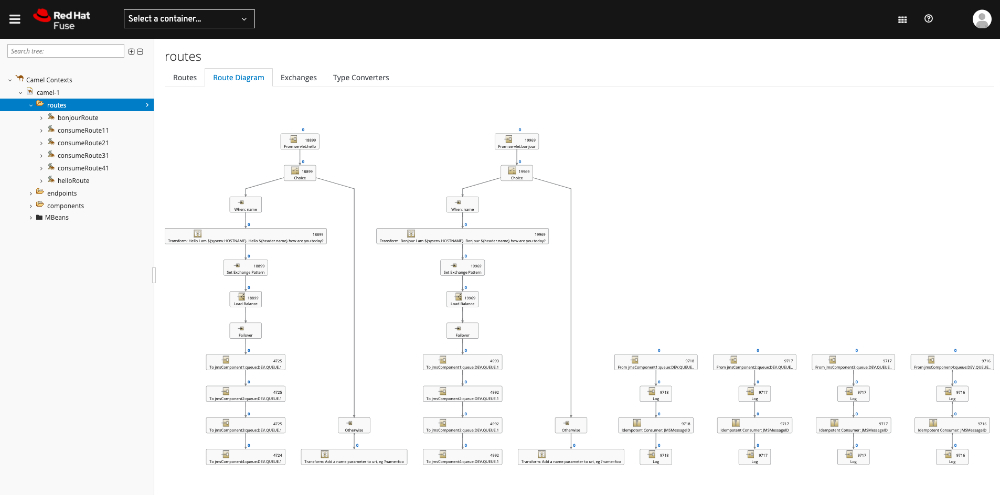
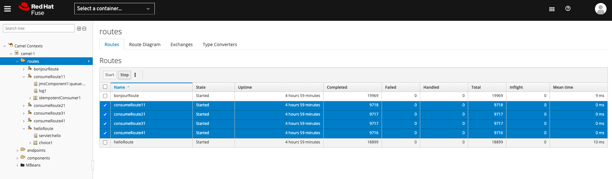
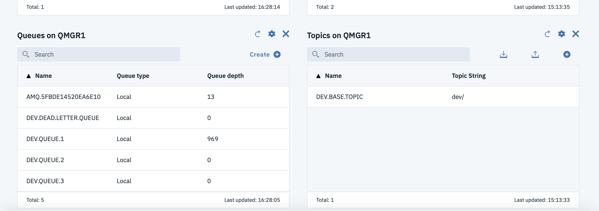
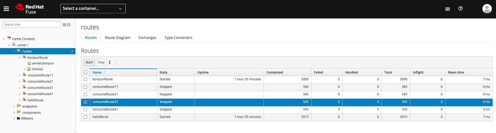
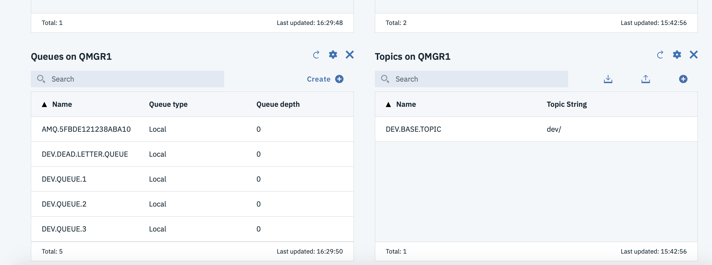

# IBMMQ-Camel連携をFuse console on OpenShiftでみるデモ

## Overview


### Design
- multiple independent IBM.MQ QMGR's
- multiple independent application pods (camel/tomcat)
- produce and consume messages using camel jms component
- idempotent consumer EIP 
- failover EIP to QMGR's
- simple round robin load balancing EIP over application pods and QMGR's (each pod connects to every QMGR)
- local transactions on QMGR's for single resource (survive a QMGR restart/outage)
- persistent volumes for QMGR's for durable messages
- scale out from one to many application pods
- scale from one to many QMGR's
- jms pooled caching connection factory


## Instructions for preparement
### Tested version
- OpenShift 4.4.30
- Operator: Red Hat Integration - Fuse Console 7.7.0


### Fuse Consoleのインストール
[参考手順:Fuse on OpenShift Guidde](https://access.redhat.com/documentation/en-us/red_hat_fuse/7.7/html/fuse_on_openshift_guide/get-started-admin#fuse-console-setup-openshift4)

1. OpenShift 4.x で Fuse Console をセキュア化するための証明書の生成  
    1.1. 作業ディレクトリへ移動して、cluster admin権限でログイン
    ```
    mkdir ./fuse-console
    cd ./fuse-console
    oc login -u <user_with_cluster_admin_role>
    ```
    1.2. サービス署名認証局のキーを取得
    - 証明書を取得
    ```
    oc get secrets/signing-key -n openshift-service-ca -o "jsonpath={.data['tls\.crt']}" | base64 --decode > ca.crt   
    ```
    - 秘密鍵を取得
    ```
    oc get secrets/signing-key -n openshift-service-ca -o "jsonpath={.data['tls\.key']}" | base64 --decode > ca.key
    ```
    1.3. クライアント証明書を作成
    - 秘密鍵
    ```
    openssl genrsa -out server.key 2048
    ```
    - CSR設定ファイル
    ```
    cat <<EOT >> csr.conf
      [ req ]
      default_bits = 2048
      prompt = no
      default_md = sha256
      distinguished_name = dn

      [ dn ]
      CN = hawtio-online.hawtio.svc

      [ v3_ext ]
      authorityKeyIdentifier=keyid,issuer:always
      keyUsage=keyEncipherment,dataEncipherment,digitalSignature
      extendedKeyUsage=serverAuth,clientAuth
    EOT
    ```
    - CSRを生成
    ```
    openssl req -new -key server.key -out server.csr -config csr.conf
    ```
    - 署名済み証明書を発行
    ```
    openssl x509 -req -in server.csr -CA ca.crt -CAkey ca.key -CAcreateserial -out server.crt -days 10000 -extensions v3_ext -extfile csr.conf
    ```

2. Operatorを使ってFuse-Consoleをインストール
 
    fuse-consoleプロジェクトを作成
    ```
    oc new-project fuse-console
    ```

    OpenShiftコンソールのOperatHubから*Red Hat Integration - Fuse Console*をインストール（Subscribe）  

      

    生成した証明書を使用してシークレットを作成し、Fuse Console にマウント
    ```
    oc create secret tls fuse-console-tls-proxying --cert server.crt --key server.key
    ```

    Installed Operatorsから*Red Hat Integration - Fuse Console*を選択。*Create Hawtio*からCRDを作成する
    ```yaml
    apiVersion: hawt.io/v1alpha1
    kind: Hawtio
    metadata:
      name: fuse-console
      namespace: fuse-console
    spec:
      replicas: 1
      ersion: 1.7-9
      type: cluster
    ```
    `type: cluster`だけ追記  


    PODまで起動した後、下記の対処をする（しないとOOMKillerでプロセス停止する現象が頻発）
    > Fuse 7.7.0 では、デプロイされた Fuse Console デプロイメントがしばらくすると不安定になり、Liveness probe failed. というエラーとともに停止と再起動が継続的に行われる可能性があります。この不安定な状態は、OpenShift で Fuse Console Pod がメモリーの割り当てを越えたことが原因です。
    > 
    > 不安定な状態を修正するには、Fuse Console デプロイメントのメモリー制限を以下のように変更します。
    > 
    > 1. oc rollout pause コマンドを使用して、Fuse Console Pod の自動再デプロイメントを一時停止します。
    > 2. Fuse Console のデプロイメント設定 (YAML ファイル) を編集して、メモリー割り当てを増やします。containers:resources:limits:memory および containers:resources:requests:memory フィールドの値を 32Mi から 100Mi に変更します。
    > 3. oc rollout resume コマンドを使用して、Fuse Console Pod の自動再デプロイメントを再開します。

    作成されたRoute:fuse-consoleからFuse Consoleへアクセスする


### IBMMQ、Camel（Tomact）のインストール
1. Clone Git repository
    ```
    git clone https://github.com/shayashi1225/ibmmq-tomcat-camel.git
    cd ibmmq-tomcat-camel
    ```
2. cluster admin権限でログイン
    ```
    oc login -u <user_with_cluster_admin_role>
    ```

3. Create new project

    ```
    oc new-project ibmmq-tomcat-camel
    ```

4. Create service account for MQ that allows anyuid
    ```
    oc create sa ibmmq
    oc adm policy add-scc-to-user anyuid -z ibmmq
    ```

5. Deploy 4 queue manager pods (requires PVC).
    ```
    ./deploy-ibmmq.sh
    ```
    MQのPODが4つ（DeploymentConfigも4つ）デプロイされるまで待つ

6. ibmmq-tomcat-camel-deploy.yamlの修正  
- DeploymentConfigの`replicas: 8`を`replicas: 1`へ修正する
    ```yaml
    ：
    - apiVersion: apps.openshift.io/v1
      kind: DeploymentConfig
      metadata:
        labels:
          app: ibmmq-tomcat-camel
        name: ibmmq-tomcat-camel
      spec:
        replicas: 8 ->1
        selector:
          app: ibmmq-tomcat-camel
          deploymentconfig: ibmmq-tomcat-camel
        strategy:
    ：
    ```
- `ca.crt: ・・・`以下の証明書の値をOpenShiftから取得した値で修正する。（Fuse-Consoleのインストールで出力したca.crtの内容で上書きする）

    ```yaml
    ：
    - apiVersion: v1
      data:
        ca.crt: |
          -----BEGIN CERTIFICATE-----
          MIIFfjCCBGagAwIBAgISA1vacVV64qdJwQprhPHvax4aMA0GCSqGSIb3DQEBCwUA
    ：
    ```

7. Deploy 8 application pods
    ```
    oc apply -f ibmmq-tomcat-camel-deploy.yaml
    ```

8. ibmmq-camel-tomcat PODが起動してくるまで待つ。起動したらFuse Console 上で表示される。


Camelルート


## Demo Instructions
### 疎通確認
`ibmmq-tomcat-camel`プロジェクトのroute:ibmmq-tomcat-camelへアクセスする  


`Hello Route`リンクをクリックして、レスポンス`Hello I am <Pod名>. Hello mike how are you today?`が表示される。さらにFuse console上で`helloRoute`のComplete数が+1されていればOK。

### 手順
> Note: performance-test.sh(の中で呼ばれているabコマンド（Apache Bemchmark))は、MacOSで正常に動作しなかったので、RHELで実行することを推奨

Fuse Console上で、MQからメッセージを取得するCamelルート(consumeRouteX)を停止する


perform-test.shを実行する
```
export HOST=http://$(oc get route ibmmq-tomcat-camel --template='{{ .spec.host }}')

./performance/performance-test.sh
```

MQ管理画面（`ibmmq-tomcat-camel`プロジェクトのroute:qmgr[1-4]、ユーザ：admin/パスワード:passw0rdでアクセス）でQueueが溜まっていくのを確認。メッセージを取得するCamelルートを停止しているので。


Fuse Console上で、MQからメッセージを取得するCamelルートを起動する。Completed件数が増えていく。


MQ管理画面（`ibmmq-tomcat-camel`プロジェクトのroute:qmgr[1-4]、ユーザ：admin/パスワード:passw0rdでアクセス）でQueueがなくなっていくの確認。



perform-test.sh実行マシンの`/tmp/data/performanceresults/日付`に性能テスト結果が保存される。以下のようなpngも出力される。


あとは自由に。Pod：ibmmq-tomcat-camelをスケールさせたり、停止させてみたり、、、